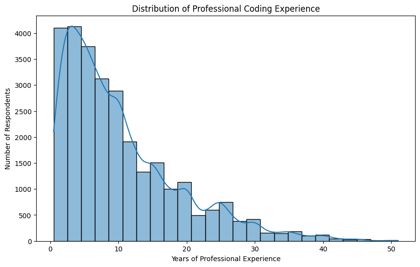
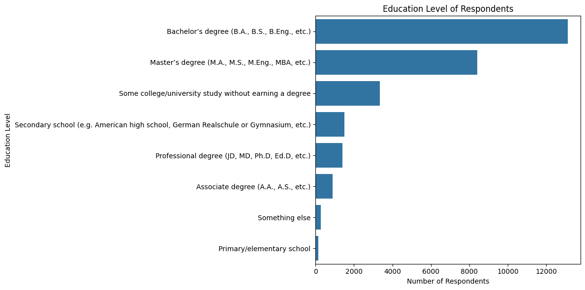
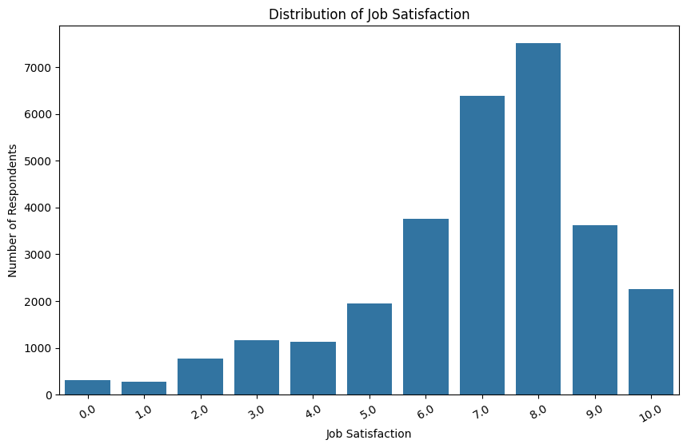
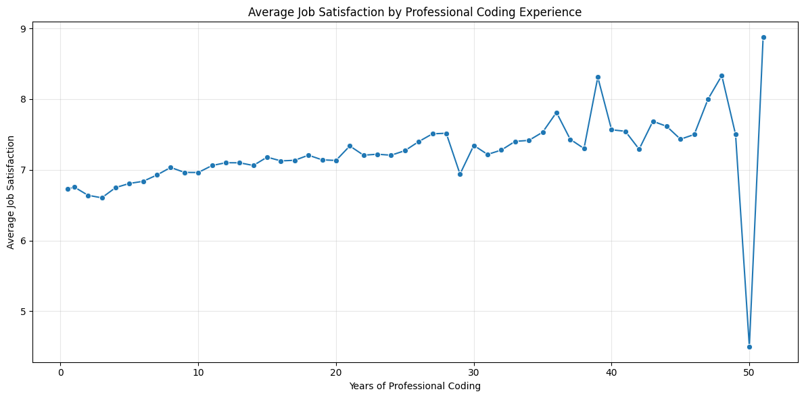
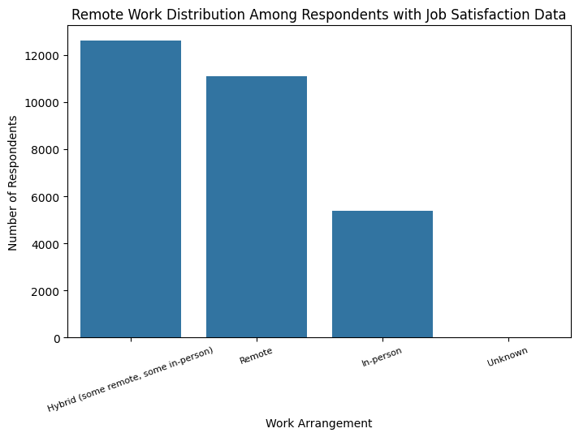
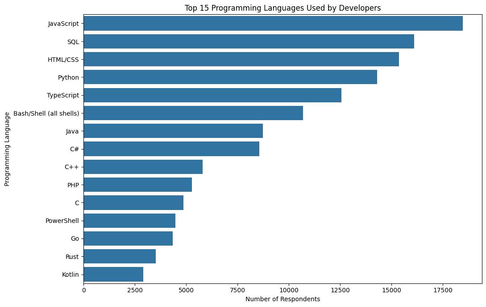
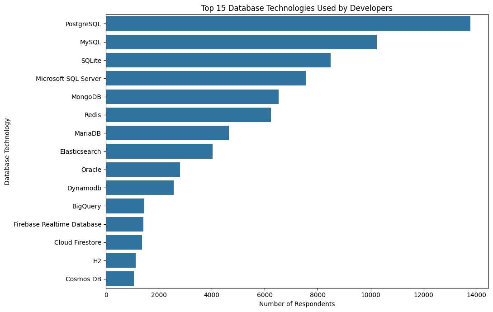

# Developer Workforce and Job Satisfaction Analysis

## Project Overview

This project explores the Stack Overflow Developer Survey using Python to analyze developer professional experience, job satisfaction, remote work preferences, education, and technology usage.

The project demonstrates a complete Exploratory Data Analysis (EDA) workflow, including data quality assessment, data cleaning, transformation, visualization, and interpretation of business insights.

---

## Business Objective

The objective of this project is to demonstrate practical data analysis skills by:

- Assessing data quality and handling missing values
- Cleaning and transforming raw survey data
- Analyzing professional experience and job satisfaction
- Investigating remote work preferences
- Identifying technology usage trends
- Communicating insights through data visualization

---

## Dataset

This project uses the public **Stack Overflow Developer Survey** dataset.

**Official source:**

https://survey.stackoverflow.co/

The dataset included in this repository is provided in compressed (.zip) format for storage efficiency.

---

## Tools & Technologies

- Python
- Pandas
- Matplotlib
- Seaborn
- Jupyter Notebook

---

## Project Workflow

1. Import libraries
2. Data loading and inspection
3. Data quality assessment
3. Data cleaning and transformation
4. Exploratory data analysis and visualization
5. Summary and key findings

---

## Key Skills Demonstrated

- Data Cleaning
- Exploratory Data Analysis
- Data Visualization
- Statistical Analysis
- Business Insight Generation
- Python Programming
- Pandas Data Manipulation

---

# Visualizations

## Distribution of Professional Coding Experience



---

## Education Level



---

## Job Satisfaction



---

## Job Satisfaction vs Professional Experience



---

## Remote Work Distribution



---

## Top Programming Languages



---

## Top Database Technologies



---
### Key Findings

- Most respondents reported fewer than 10 years of professional coding experience.
- Job satisfaction ratings were generally concentrated in the upper half of the scale.
- Hybrid and remote work arrangements were more common than fully in-person work.
- Bachelor's and Master's degrees represented the largest educational groups.
- JavaScript, SQL, HTML/CSS, and Python were among the most widely used programming languages.
- PostgreSQL, MySQL, SQLite, and Microsoft SQL Server were among the most commonly used database technologies.
- Professional coding experience showed only a modest relationship with average job satisfaction, suggesting that additional factors are likely to influence developers' satisfaction at work.
---

## Repository Structure

```text
developer-survey-eda/
│
├── data/
│   └── survey_data_CSV_ZIPfile.zip
│
├── notebooks/
│   └── Developer Survey EDA_Python_final.ipynb
│
├── images/
│   ├── distribution_of_professional_coding_experience.png
│   ├── education_level.png
│   ├── job_satisfaction.png
│   ├── job_satisfaction_vs_experience.png
│   ├── remote_work_distribution.png
│   ├── top_database_technologies.png
│   └── top_programming_languages.png
│
└── README.md
```

---

## Author

**Viktoryia Vashkevich**

Business & Financial Analyst transitioning into Data Analytics

📍 Massachusetts, USA

- Excel
- SQL
- Python
- Pandas
- Data Visualization
- Business Analysis

LinkedIn:
https://www.linkedin.com/in/viktoryia-vashkevich-147702261/
